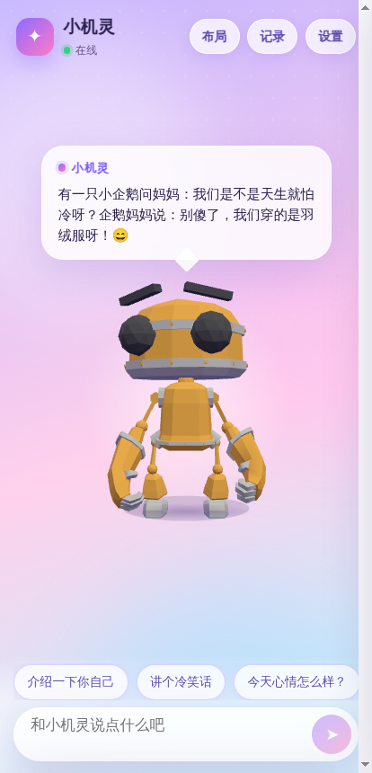

# MetaHuman · 小机灵

一个基于 **Taro 4 + React + Three.js + DeepSeek** 的可爱 3D 数字人聊天应用，同时支持：

- 微信小程序（`three-platformize`）
- H5 / Android App（Capacitor 打包，GitHub Actions 自动产出 APK）

<p align="center">
  
</p>

## 功能

- 内置 5 个开源 3D 形象，设置里一键切换：
  - [RobotExpressive](https://github.com/mrdoob/three.js/tree/dev/examples/models/gltf/RobotExpressive)（three.js 示例，CC0，14 组动画 + 表情 morph）
  - Xbot / Soldier / Michelle（three.js 示例，Mixamo 角色，带待机 / 手势 / 舞蹈动画）
  - [Fox](https://github.com/KhronosGroup/glTF-Sample-Assets/tree/main/Models/Fox)（Khronos glTF 示例，CC-BY 4.0）
  - 也支持填入任意 GLB 地址作为自定义形象，动画名会自动匹配
- 接入 DeepSeek 大模型，回复过程中角色会做手势 / 摆头 / 开口动画，思考时低头沉思
- 打字机式对话气泡，可限制回复字数、调节字号、说话速度
- **布局模式**：角色与对话框都可以随意拖动、拉角缩放，布局自动保存
- 设置面板：形象卡片切换、DeepSeek 模型卡片（V3 `deepseek-chat` / R1 `deepseek-reasoner`）、API Key、人设、主题（极光 / 落日 / 海洋 / 星夜）、自定义 GLB 地址
- 对话记录侧栏、快捷提问、点击角色有惊喜

## 开发

```bash
npm install

npm run dev:h5      # 浏览器调试
npm run dev:weapp   # 微信开发者工具打开 dist/weapp
```

生产构建：

```bash
npm run build:h5     # -> dist/h5
npm run build:weapp  # -> dist/weapp
```

## DeepSeek Key

默认内置了一个**测试用** Key（`src/constants.ts` 里的 `DEFAULT_DEEPSEEK_API_KEY`），可以在 App 的「设置」面板里随时替换，Key 会保存在本地存储。正式发布请删除默认 Key 或改为服务端转发。

## 微信小程序注意事项

在 [mp.weixin.qq.com](https://mp.weixin.qq.com) 后台配置服务器域名：

| 类型 | 域名 |
| --- | --- |
| request 合法域名 | `https://api.deepseek.com` |
| downloadFile 合法域名 | `https://cdn.jsdelivr.net`（3D 模型）|

如需把 GLB 换成自己的 CDN，在「设置 → 3D 模型地址」里填写即可。`project.config.json` 中的 `appid` 请替换为你自己的。

## Android APK

仓库自带 Capacitor Android 工程（`android/`）以及 GitHub Actions 工作流 [`.github/workflows/android.yml`](.github/workflows/android.yml)：

- 每次 push 到 `main` / PR 都会构建 **debug APK**（可直接安装）和小程序包，产物在 Actions → Artifacts
- 推送 `v*` 标签会自动创建 GitHub Release 并附上 APK
- 配置以下 Secrets 后会额外产出**签名的 release APK**：
  `ANDROID_KEYSTORE_BASE64`、`ANDROID_KEYSTORE_PASSWORD`、`ANDROID_KEY_ALIAS`、`ANDROID_KEY_PASSWORD`

本地打包（需要 JDK 21 + Android SDK）：

```bash
npm run build:android          # build:h5 + cap sync
cd android && ./gradlew assembleDebug
```

## 目录

```
src/
  components/
    Avatar3D/       Taro Canvas + Three 场景封装（H5 / 小程序双端）
    DragBox/        可拖动、可缩放容器
    SpeechBubble/   对话气泡（打字机 / 思考态）
    SettingsPanel/  设置抽屉
    HistoryPanel/   对话记录
    ChatBar/        输入栏 + 快捷提问
  three/
    AvatarScene.ts  角色加载、动画状态机（idle / thinking / speaking）
    platform.ts     H5 适配
    platform.weapp.ts 小程序适配（three-platformize）
  services/deepseek.ts  DeepSeek Chat Completions
  store/settings.ts     设置 / 布局持久化
```
